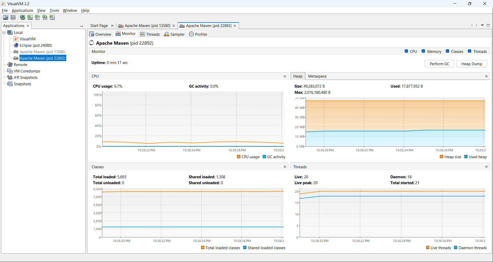
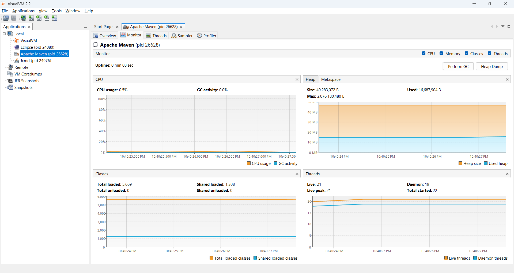
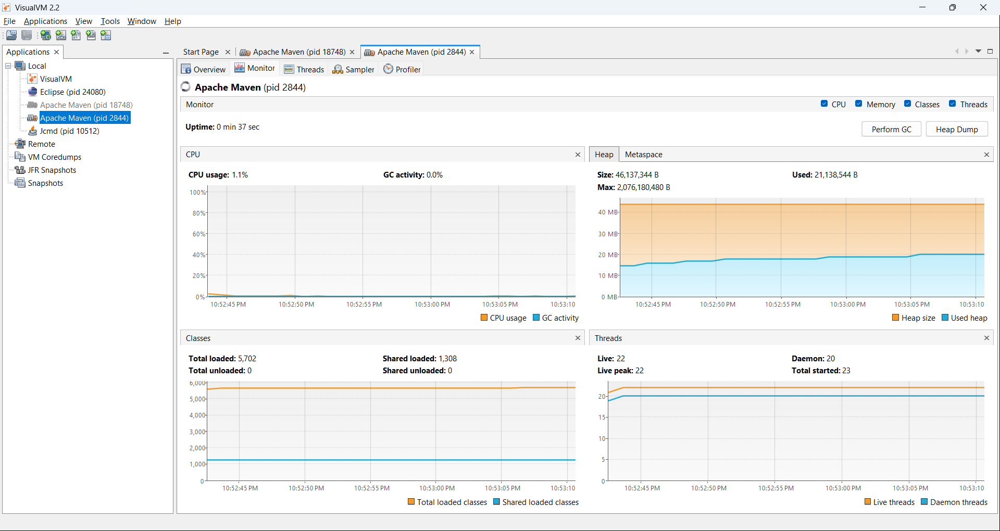
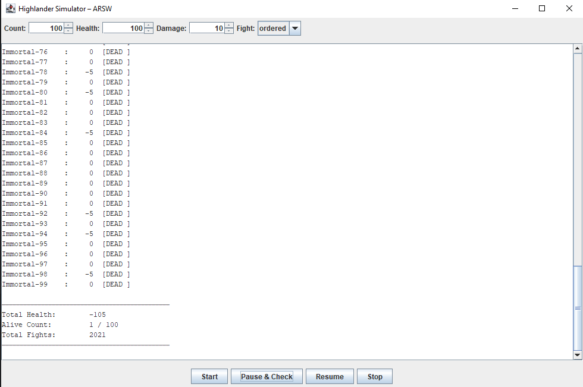
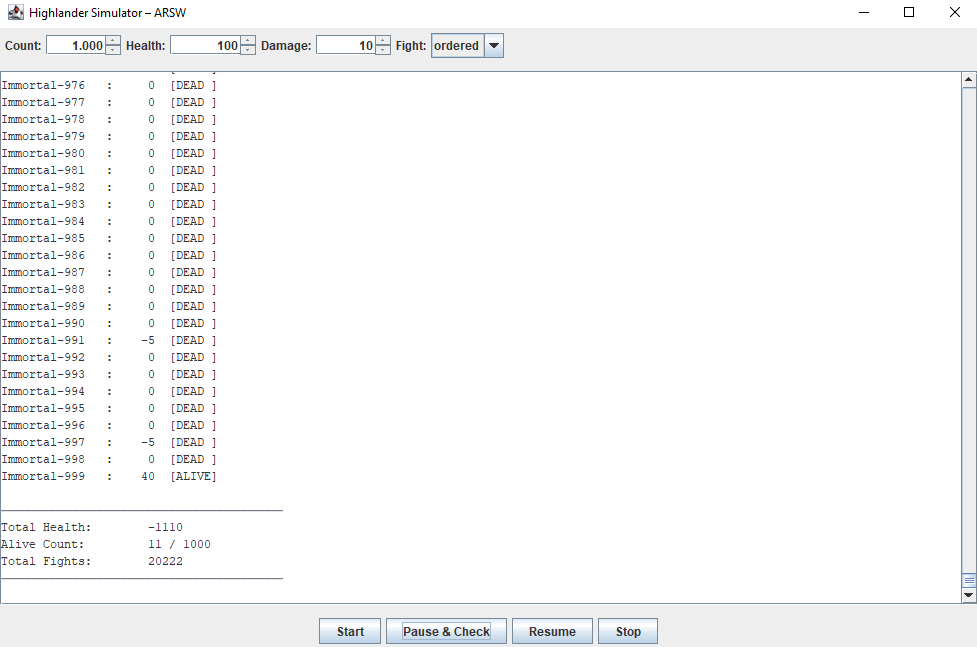
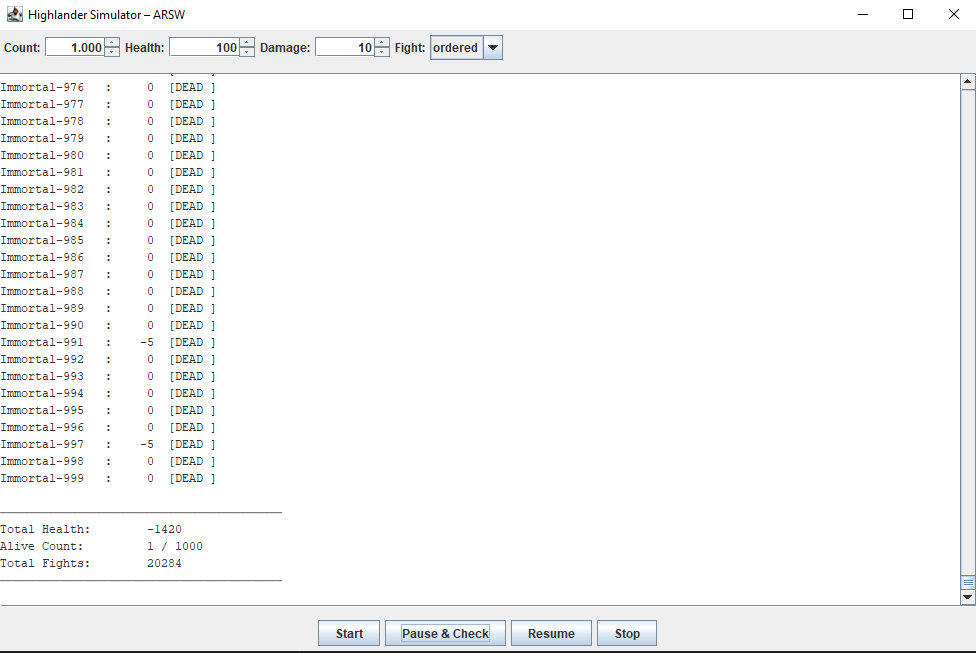
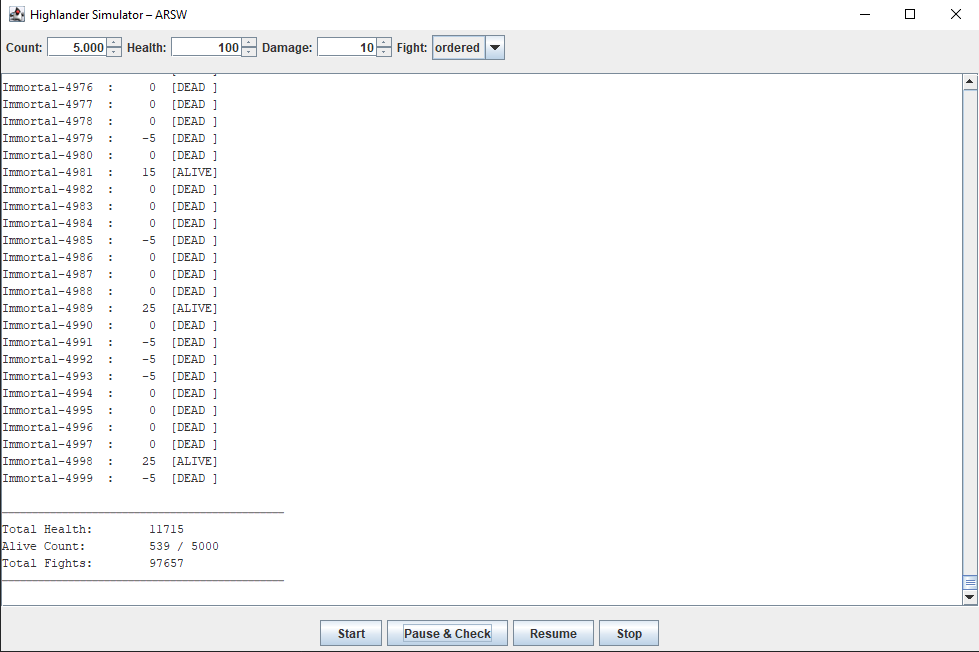
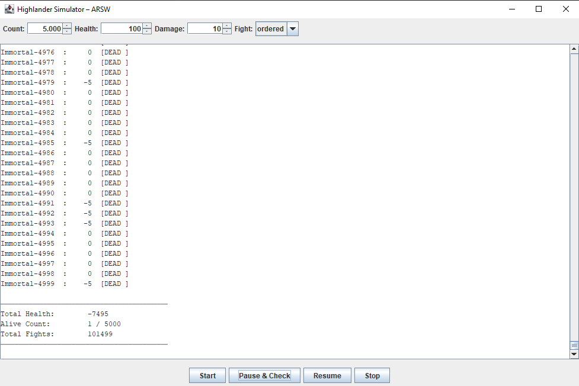

# ARSW — (Java 21): **Immortals & Synchronization** — con UI Swing

**Escuela Colombiana de Ingeniería – Arquitecturas de Software**  
Laboratorio de concurrencia: condiciones de carrera, sincronización, suspensión cooperativa y *deadlocks*, con interfaz **Swing** tipo *Highlander Simulator*.


---

## Requisitos

- **JDK 21** (Temurin recomendado)
- **Maven 3.9+**
- SO: Windows, macOS o Linux

---

## Cómo ejecutar

### Interfaz gráfica (Swing) — *Highlander Simulator*

**Opción A (desde `Main`, modo `ui`)**
```bash
mvn -q -DskipTests exec:java -Dmode=ui -Dcount=8 -Dfight=ordered -Dhealth=100 -Ddamage=10
```

**Opción B (clase de la UI directamente)**
```bash
mvn -q -DskipTests exec:java   -Dexec.mainClass=edu.eci.arsw.highlandersim.ControlFrame   -Dcount=8 -Dfight=ordered -Dhealth=100 -Ddamage=10
```

**Parámetros**  
- `-Dcount=N` → número de inmortales (por defecto 8)  
- `-Dfight=ordered|naive` → estrategia de pelea (`ordered` evita *deadlocks*, `naive` los puede provocar)  
- `-Dhealth`, `-Ddamage` → salud inicial y daño por golpe

### Demos teóricas (sin UI)
```bash
mvn -q -DskipTests exec:java -Dmode=demos -Ddemo=1  # 1 = Deadlock ingenuo
mvn -q -DskipTests exec:java -Dmode=demos -Ddemo=2  # 2 = Orden total (sin deadlock)
mvn -q -DskipTests exec:java -Dmode=demos -Ddemo=3  # 3 = tryLock + timeout (progreso)
```

---

## Controles en la UI

- **Start**: inicia una simulación con los parámetros elegidos.
- **Pause & Check**: pausa **todos** los hilos y muestra salud por inmortal y **suma total** (invariante).
- **Resume**: reanuda la simulación.
- **Stop**: detiene ordenadamente.

**Invariante**: con N jugadores y salud inicial H, la **suma total** de salud debe permanecer constante (salvo durante un update en curso). Usa **Pause & Check** para validarlo.

---

## Arquitectura (carpetas)

```
edu.eci.arsw
├─ app/                 # Bootstrap (Main): modes ui|immortals|demos
├─ highlandersim/       # UI Swing: ControlFrame (Start, Pause & Check, Resume, Stop)
├─ immortals/           # Dominio: Immortal, ImmortalManager, ScoreBoard
├─ concurrency/         # PauseController (Lock/Condition; paused(), awaitIfPaused())
├─ demos/               # DeadlockDemo, OrderedTransferDemo, TryLockTransferDemo
└─ core/                # BankAccount, TransferService (para demos teóricas)
```

---

# Actividades del laboratorio

## Parte I — (Antes de terminar la clase) `wait/notify`: Productor/Consumidor
1. Ejecuta el programa de productor/consumidor y monitorea CPU con **jVisualVM**. ¿Por qué el consumo alto? ¿Qué clase lo causa?
**Respuesta:** Al ejecutar el programa con BUSY-WAITING obtenemos:

El consumo de CPU es alto porque la implementación usa BUSY-WAITING (espera activa). Cuando la cola está vacía, el consumidor no se bloquea, sino que ejecuta un bucle infinito verificando constantemente si hay elementos disponibles.

La clase BusySpinQueue causa el problema, específicamente el método take():
    public T take() {
        while (true) {
            T v = q.pollFirst();
            if (v != null) return v;
            Thread.onSpinWait(); // ← Sigue consumiendo CPU
        }
    }

El bucle while(true) se ejecuta millones de veces por segundo, consumiendo mas CPU de lo normal, aunque es clave aclarar que podria ser mayot debido a que se usa Virtual Threads que son propios de las ultimas versiones de JAVA y los hace mas eficientes, sin embargo el problema del BUSY-WAITING sigue estando solo que no se ve en la CPU. No tiene una condicion de parar sino que va a seguir indefinidamente consumiendo mas.

2. Ajusta la implementación para **usar CPU eficientemente** cuando el **productor es lento** y el **consumidor es rápido**. Valida de nuevo con VisualVM.
**Respuesta:** En el segundo escenario:

Se cambió de BusySpinQueue (busy-wait) a BoundedBuffer (wait/notify).

La clase BoundedBuffer usa el patrón de monitores, que cuando la cola está vacía, el consumidor ejecuta this.wait() esto BLOQUEA el hilo y lo saca del scheduler de CPU. El productor ejecuta this.notifyAll() al agregar elementos, esto DESPIERTA al consumidor solo cuando hay trabajo.

3. Ahora **productor rápido** y **consumidor lento** con **límite de stock** (cola acotada): garantiza que el límite se respete **sin espera activa** y valida CPU con un stock pequeño.
**Respuesta:** Al acotar la cota obtenemos un resultado favorable:

El límite se respeta perfectamente. Aunque el productor es 50× más rápido (1ms vs 50ms), se sincroniza automáticamente con el consumidor mediante `wait()/notifyAll()`, esperando eficientemente sin consumir CPU cuando la cola alcanza su capacidad máxima.

> Nota: la Parte I se realiza en el repositorio dedicado https://github.com/DECSIS-ECI/Lab_busy_wait_vs_wait_notify — clona ese repo y realiza los ejercicios allí; contiene el código de productor/consumidor, variantes con busy-wait y las soluciones usando wait()/notify(), además de instrucciones para ejecutar y validar con jVisualVM.


> Usa monitores de Java: **`synchronized` + `wait()` + `notify/notifyAll()`**, evitando *busy-wait*.

---

## Parte II — (Antes de terminar la clase) Búsqueda distribuida y condición de parada
Reescribe el **buscador de listas negras** para que la búsqueda **se detenga tan pronto** el conjunto de hilos detecte el número de ocurrencias que definen si el host es confiable o no (`BLACK_LIST_ALARM_COUNT`). Debe:
- **Finalizar anticipadamente** (no recorrer servidores restantes) y **retornar** el resultado.  
- Garantizar **ausencia de condiciones de carrera** sobre el contador compartido.

> Puedes usar `AtomicInteger` o sincronización mínima sobre la región crítica del contador.

**Respuesta:** Programa adjunto. Revisar archivo BlackListThreadOptimized.

---

## Parte III — (Avance) Sincronización y *Deadlocks* con *Highlander Simulator*
1. Revisa la simulación: N inmortales; cada uno **ataca** a otro. El que ataca **resta M** al contrincante y **suma M/2** a su propia vida. 

    Revisé que la pelea haga exactamente lo que pide el enunciado: el atacante le resta M al otro y se suma M/2 a sí mismo, siempre verificando que ambos estén vivos antes de modificar la salud. Centralicé esa lógica en un solo método para no duplicar código y evitar inconsistencias. Con eso me aseguré de que cada pelea siga la regla exacta del modelo y que el contador de peleas también se actualice correctamente

2. **Invariante**: con N y salud inicial `H`, la suma total debería permanecer constante (salvo durante un update). Calcula ese valor y úsalo para validar.  

    Al principio asumí que la suma total era constante, pero realmente no lo es: en cada pelea el sistema pierde M/2 neto porque uno pierde M y el otro gana M/2. Entonces el valor esperado es: N × H = (peleas × M/2 + vida total)

3. Ejecuta la UI y prueba **“Pause & Check”**. ¿Se cumple el invariante? Explica.

    Antes no se cumplía, porque se pausaba pero no se garantizaba que todos los hilos estuvieran realmente detenidos al momento de leer la salud, entonces la suma salía mal. Después implementé un snapshot atómico adquiriendo los locks en orden consistente antes de leer, y ahora sí: al hacer “Pause & Check” el invariante siempre da diferencia 0. O sea, el problema no era la fórmula sino la lectura concurrente

4. **Pausa correcta**: asegura que **todos** los hilos queden pausados **antes** de leer/imprimir la salud; implementa **Resume** (ya disponible).

    La pausa funciona poniendo una bandera y haciendo que cada hilo pase por awaitIfPaused(), donde se bloquea hasta que se haga resume. Además, doy un pequeño margen para que todos alcancen el punto de espera antes de hacer el snapshot. El Resume simplemente hace signalAll() y todos los hilos continúan. Así me aseguro de que al pausar, realmente no haya peleas ejecutándose mientras se imprime la salud

5. Haz *click* repetido y valida consistencia. ¿Se mantiene el invariante?  

    Probé hacer muchos clicks seguidos en “Pause & Check” intercalando con Resume, y el invariante siempre se mantiene. Eso confirma que no hay lecturas inconsistentes ni efectos raros acumulados. Si hubiera una race condition, tarde o temprano la diferencia no sería 0, pero con el snapshot atómico y la pausa correcta se mantiene estable

6. **Regiones críticas**: identifica y sincroniza las secciones de pelea para evitar carreras; si usas múltiples *locks*, anida con **orden consistente**:
   ```java
   synchronized (lockA) {
     synchronized (lockB) {
       // ...
     }
   }
   ```
    La región crítica real es cuando se modifican las dos vidas en una pelea. Para evitar carreras y deadlock, usé un orden total por nombre o id, siempre se adquieren los locks en el mismo orden. Así, aunque dos inmortales se ataquen entre sí al mismo tiempo, nunca se forma un ciclo de espera. Con el enfoque naive sí podía haber deadlock, pero con orden consistente no

7. Si la app se **detiene** (posible *deadlock*), usa **`jps`** y **`jstack`** para diagnosticar.  

    Probé usando la versión native la que bloquea primero this y luego other sin orden global, pero aun así no pude replicar el deadlock en mis ejecuciones. Sin embargo, teóricamente sí es totalmente posible, porque si dos hilos intentan atacarse mutuamente al mismo tiempo, uno puede tomar el lock de A y esperar el de B, mientras el otro toma el de B y espera el de A, formando un ciclo de espera circular. En ese caso, con jps se obtiene el PID y con jstack se podría ver en el thread dump ambos hilos en estado BLOCKED esperando el monitor que tiene el otro, confirmando el deadlock aunque en mis pruebas no se haya manifestado

8. Aplica una **estrategia** para corregir el *deadlock* (p. ej., **orden total** por nombre/id, o **`tryLock(timeout)`** con reintentos y *backoff*). 

    La estrategia que dejé fue orden total por nombre/id porque es simple y matemáticamente elimina el deadlock. Alternativamente se puede usar tryLock con timeout y reintentos con backoff, pero eso complica más el código y puede generar starvation. Con orden total todos los hilos siguen la misma regla, así que no hay ciclos posibles

9. Valida con **N=100, 1000 o 10000** inmortales. Si falla el invariante, revisa la pausa y las regiones críticas.  

- Validar con N = 100

    
    Como se pude ver en la imagen el invariante N × H = (peleas × M/2 + vida total)
    se cumple: 
    
    (100 * 100) = (2021 * 10/5 + -105)

    (10000) = (10105 + -105)

    (10000 = 10000)

    La ejecucion fue tan rapida que nu pude verificar la pausa.

- Validar con N = 1000

    Primero hacemos una pausa para verificar que el invariante se cumple al pausar
    
    Como se pude ver en la imagen el invariante N × H = (peleas × M/2 + vida total)
    se cumple:

    (1000 * 100) = (20222 * 10/2 + -1110)

    (100000) = (101110 + -1110)

    (100000 = 100000)

    Al seguir vemos
    
    Y se cumple el invariante:

    (1000 * 100) = (20284 * 10/2 + -1420)

    (100000) = (101420 + -1420)

    (100000 = 100000)


- Validar con N = 5000 (No se podia poner 10000)

    Primero hacemos una pausa para verificar que el invariante se cumple al pausar
    
    Como se pude ver en la imagen el invariante N × H = (peleas × M/2 + vida total)
    se cumple:

    (5000 * 100) = (97657 * 10/2 + 11715)

    (500000) = (488285 + 11715)

    (500000 = 500000)

    Al seguir vemos
    
    Y se cumple el invariante:

    (5000 * 100) = (101499 * 10/2 + -7495)

    (500000) = (507495 + -7495)

    (500000 = 500000)


10. **Remover inmortales muertos** sin bloquear la simulación: analiza si crea una **condición de carrera** con muchos hilos y corrige **sin sincronización global** (colección concurrente o enfoque *lock-free*).

    Cambiar a una colección concurrente como CopyOnWriteArrayList permitió eliminar muertos sin sincronización global y sin lanzar ConcurrentModificationException. Los iteradores trabajan sobre una copia, así que no se rompe nada aunque otro hilo elimine elementos. Como hay muchas más lecturas que escrituras, este enfoque funciona bien y evita meter un lock global que frenaría toda la simulación

11. Implementa completamente **STOP** (apagado ordenado).

    Implementé un stop en fases: primero se marca running = false en cada inmortal, luego se hace resume por si alguno estaba pausado, después se hace shutdown() del executor y se espera su terminación. Si no termina a tiempo, se fuerza con shutdownNow(). Así me aseguro de que no queden hilos zombie y que el cierre sea limpio y controlado, incluso si la simulación estaba en pausa cuando se presionó STOP


---

## Entregables

1. **Código fuente** (Java 21) con la UI funcionando.  
2. **`Informe de laboratorio en formato pdf`** con:
   - Parte I: diagnóstico de CPU y cambios para eliminar espera activa.  
   - Parte II: diseño de **parada temprana** y cómo evitas condiciones de carrera en el contador.  
   - Parte III:  
     - Regiones críticas y estrategia adoptada (**orden total** o **tryLock+timeout**).  
     - Evidencia de *deadlock* (si ocurrió) con `jstack` y corrección aplicada.  
     - Validación del **invariante** con **Pause & Check** (distintos N).  
     - Estrategia para **remover inmortales muertos** sin sincronización global.
3. Instrucciones de ejecución si cambias *defaults*.

---

## Criterios de evaluación (10 pts)

- (3) **Concurrencia correcta**: sin *data races*; sincronización bien localizada; no hay espera activa.  
- (2) **Pausa/Reanudar**: consistencia del estado e invariante bajo **Pause & Check**.  
- (2) **Robustez**: corre con N alto; sin `ConcurrentModificationException`, sin *deadlocks* no gestionados.  
- (1.5) **Calidad**: arquitectura clara, nombres y comentarios; separación UI/lógica.  
- (1.5) **Documentación**: **`RESPUESTAS.txt`** claro con evidencia (dumps/capturas) y justificación técnica.

---

## Tips y configuración útil

- **Estrategias de pelea**:  
  - `-Dfight=naive` → útil para **reproducir** carreras y *deadlocks*.  
  - `-Dfight=ordered` → **evita** *deadlocks* (orden total por nombre/id).
- **Pausa cooperativa**: usa `PauseController` (Lock/Condition), **sin** `suspend/resume/stop`.  
- **Colecciones**: evita estructuras no seguras; prefiere inmutabilidad o colecciones concurrentes.  
- **Diagnóstico**: `jps`, `jstack`, **jVisualVM**; revisa *thread dumps* cuando sospeches *deadlock*.  
- **Virtual Threads**: favorecen esperar con bloqueo (no *busy-wait*); usa timeouts.

---

## Cómo correr pruebas

```bash
mvn clean verify
```

Incluye compilación y pruebas JUnit.

---

## Créditos y licencia

Laboratorio basado en el enunciado histórico del curso (Highlander, Productor/Consumidor, Búsqueda distribuida), modernizado a **Java 21**.  
<a rel="license" href="http://creativecommons.org/licenses/by-nc/4.0/"></a><br />Este contenido hace parte del curso Arquitecturas de Software (ECI) y está licenciado como <a rel="license" href="http://creativecommons.org/licenses/by-nc/4.0/">Creative Commons Attribution-NonCommercial 4.0 International License</a>.
